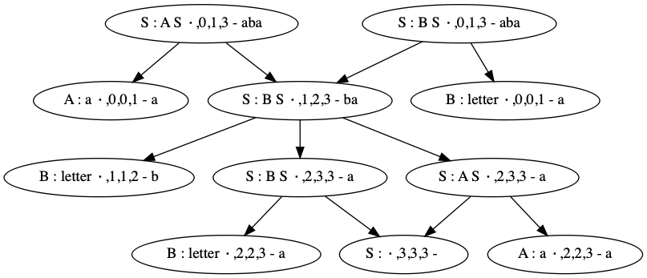

# Walking the BSR Parse Forest
`Gogll` generates a parse forest in the course of successfully parsing an input string. 
The parse forest is stored as a binary subtree representation (BSR) set [[Scott et al 2019](../../Readme.md)]. This document describes how to walk the BSR set.

For a gogll generated parser the parse forest is in `<module>/goutil/bsr`.

The figure below shows the parse forest generated by gogll for the [ambiguous1](../../examples/ambiguous1/g.md) grammar:

    *S : A S | B S | empty ;
    A : 'a' ;
    B : letter ;

and the input string 

    aba

The forest contains 2 parse tree roots:

    S : A S ∙,0,1,3 - aba

and

    S : B S ∙,0,1,3 - aba

`S : A S ∙,0,1,3 - aba` is an annotated grammar slot, which specifies that:

1. The grammar rule alternate, `S : A S` was successfully parsed.
1. The left extent (the index of the leftmost UTF-8 character of the grammar slot) is 0. Thus the index of the first `a` of `aba` is `0`.
1. The right extent (the index of the next input character after the last character of the grammar slot) is 3. Thus the index of the last `a` of `aba` is 2.
1. The complete substring of the input that was parsed as the grammar slot is `aba`.
1. The middle digit between the left and right extent of a grammar slot is not important for this discussion.

The root `S : A S ∙,0,1,3 - aba` has 2 children:

1. `A : a ∙,0,0,1 - a`
1. `S : B S ∙,1,2,3 - ba`

## Walking the parse forest
The parse forest can be walked as follows:

1. Find the roots of the the parse forest. Package `bsr` provides 2 functions for that:

    `func GetRoot()BSR` returns the root of a parse forest with only one rooted parse tree. If the forest has multiple roots
    this function will panic.

    `func GetRoots()[]BSR` returns the set of roots of all the parse trees in the forest. If the parse was successful the forest must contain at least one rooted parse tree.

1. For any grammar slot, including a root, find which alternate of the rule it is. Package bsr provides the following function for that:

    `func (b BSR) Alternate() int`

   For example:

        for _, r := range bsr.GetRoots() {
            switch r.Alternate() {
            case 0: // S : A S
                ...
            case 1: // S : B S
                ...
            case 2: // S : empty
                ...
            }
        }

1. For any grammar slot `b` of type `bsr.BSR` we can get the binary subtree representations of every non-terminal symbol in the body of the grammar rule of `b`. Package `bsr` provides the following functions for that:

    1. `func (b BSR) GetNTChild(nt string, i int) BSR` returns the BSR for the i^th occurrence of non-terminal `nt` in the body of the grammar rule of `b`. 
    The function panics if the symbol has multiple (ambiguous) subtrees. In this case `GetNTChildren(...)` should be used.
    The function returns nil if b has no subtrees for non-terminal `nt`. This can happen after a disambiguation process removed some subtrees from the parse forest.
    1. `func (b BSR) GetNTChildI(i int) BSR` returns the BSR of the i^th symbol in the body of the grammar rule of `b`. The function panics if the symbol is not a non-terminal or if the symbol has ambiguous children.
    1. `func (b BSR) GetNTChildren(nt string, i int) []BSR` returns all the children of the `i^th` occurrence of non-terminal `nt` in the body of the grammar rule of `b`. The function returns `nil` if the symbol has no children (e.g.: due to disabiguation), one BSR if the subtree is unambigous or all the ambiguous children.
    1. `func (b BSR) GetNTChildrenI(i int) []BSR` returns all the children of the `i^th` symbol of the grammar rule of `b`. The function panics if the symbol is not a non-terminal, or returns zero more more subtree slots as above.

## Example: walking the parse forest above to disambiguate
*See [examples/ambiguous1](../../examples/ambiguous1/ambiguous1_test.go) for the complete example.*

Walk each of the roots of the BSR set:

    ...
    for _, r := range bsr.GetRoots() {
		walk(r, dw, nilBSR)
	}
    ...

    type walker interface {
        do(node, parent bsr.BSR)
    }

    func walk(node bsr.BSR, w walker, parent bsr.BSR) {
        w.do(node, parent)

Switch on the rule head:

     switch node.Label.Head() {
     case "S":

Switch on the rule alternate:    

         switch node.Alternate() {
         case 0: // S : A S

Iterate over the ambiguous subtrees:

             for _, a := range node.GetNTChildren("A", 0) {
                 walk(a, w, node)
             }
             for _, s := range node.GetNTChildren("S", 0) {
                 walk(s, w, node)
             }
         case 1: // S : B S
             for _, b1 := range node.GetNTChildren("B", 0) {
                 walk(b1, w, node)
             }
             for _, s := range node.GetNTChildren("S", 0) {
                 walk(s, w, node)
             }
         case 2: // S : empty
             // ignore
         }
     case "A":
         // ignore
     case "B":
         // ignore
     }
 }
